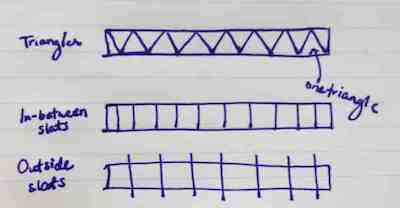
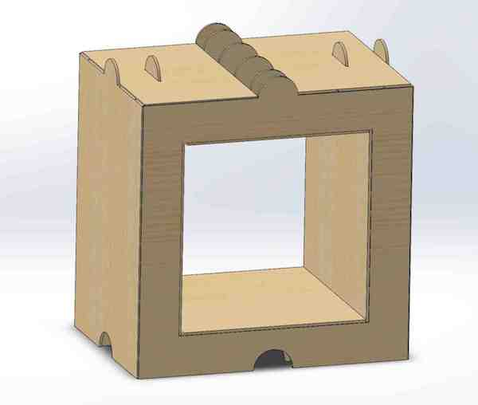
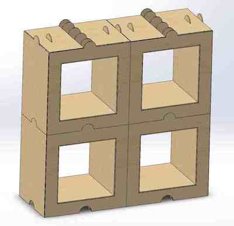
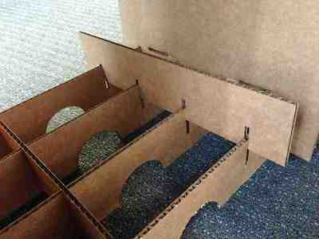
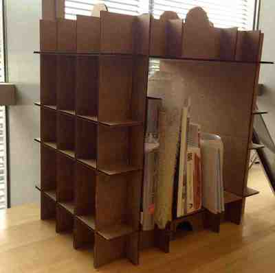

This week, I set out to make something for my desk. Since I've been working with lots of kid's storybooks, there is currently a pile of books on my desk that topples over at least once a day. So naturally, I wanted to make a bookshelf. 

The first thing I started thinking of is: books are heavy. One sheet of cardboard cannot support them. So how do you reinforce cardboard using press-fits?

One way I thought of was through building equilateral triangles out of scored cardboard, and placing them in-between two flat pieces of cardboard, to make one strong board. (See sketch below)

However, I realized this would take a ridiculous amount of cardboard to build. My next thought was to press-fit cardboard slats in-between two longer sheets of cardboard, but I realized that with the weight of the books, the slats would just fall flat. (See sketch below)

I then moved on to thinking about how to press-fit the cardboard using alternating outside braces places on each side. This seemed like the most promising idea of the three. (See sketch below)

__Different cardboard reinforcement ideas__

I didn't want to test my limited knowledge of structural integrity, so I went for building a modular bookshelf, one that was based off of small cubes (like the bookshelf we have in the Lego Lab). I then started google-ing around for inspiration, and can across a wonderful bookshelf design from a French designer named Daniel Gilles called the Stri-Cube, that allowed the cubes to be stacked to create a bookshelf of any dimension I wanted. (Image shown below.)

[Image source: www.danygilles.com]

Gilles was also using a similar approach to press-fitting cardboard that I had imagined, press-fitting large slats of cardboard into the frame of the bookshelf for stability.

I started by figuring out how Gilles made his cubes and reconstructing the cube in SolidWorks using the dimensions I wanted for my desk / my books. I then made modifications, such as adding in a semi-circle knob at the top that doubles as a handle and guide for stacking the cubes as I make more and an outside cover for the cube to hide the criss-cross of cardboard slats. Since Gilles seemed to make his cubes out of much thicker cardboard material, I made my press-fits rather large (1.5in cuts in the parts) and cut into both parts being fit together, in order to be as certain as possible that the press-fits would stay in place and provide structural integrity.

The following are some snapshots of my SolidWorks parts and assembly. I purposely picked a part that would be somewhat straightforward to construct, so that I could focus on re-discovering SolidWorks this week, remembering how to mirror parts, create correctly-defined sketches, and place part faces on drawings for print.

__Box without cover__

__Box with cover__

__Bookshelf without cover__

__Bookshelf with cover__

__Some parts ready for printing__

After SolidWorks-ing, I then went to print my parts. The first time I print, I accidentally print the entire box at a ratio of 1:2 -- half the size I wanted. At this scale, the press-fits did not work, since the thickness of the cardboard was not cut in half, and I had to re-cut everything. The second time around, I cut the box correctly, minus a few issues with fiddling with the power on the laser cutter to make the laser cut all the way through the cardboard.

__The slats that held the box together__

__Assembly of the box__

Below are some pictures of the assembly and final product.

__Isometric view of the box__

__Front view of the box__

__And the box now sitting on my desk :)__

I didn't want to print the cover or create another box, since it used up a bunch of cardboard and time on the laser cutter was in high demand. However, I hope to print more of these cubes and the covers and stack them to build a full bookshelf in the near future.

